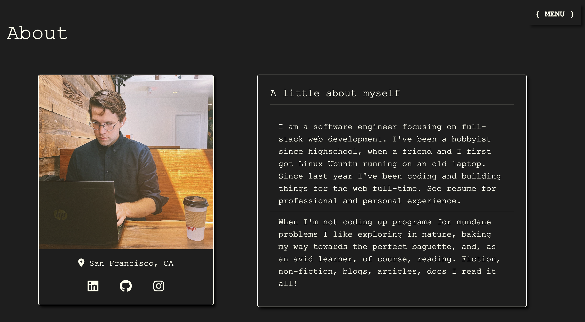

<!-- PROJECT SHIELDS -->
<!--
*** using markdown "reference style" links for readability.
*** Reference links are enclosed in brackets [ ] instead of parentheses ( ).
*** See the bottom of this document for the declaration of the reference variables
*** for contributors-url, forks-url, etc. This is an optional, concise syntax you may use.
*** https://www.markdownguide.org/basic-syntax/#reference-style-links
-->
 

  <h3 align="center">calebwood.dev v1.1</h3>

  

    Welcome to the Repo for my personal site.
     
    <a href="https://www.calebwood.dev/">Visit Site</a>
    ·
    <a href="https://github.com/othneildrew/Best-README-Template/issues">Report Bug</a>
    ·
    <a href="https://github.com/othneildrew/Best-README-Template/issues">Request Feature</a>
  

  
  

<!-- TABLE OF CONTENTS -->

  
Table of Contents

  <ol>
    <li>
      <a href="#about-the-project">About The Project</a>
      <ul>
        <li><a href="#built-with">Built With</a></li>
      </ul>
    </li>
    <li><a href="#roadmap">Roadmap</a></li>
    <li><a href="#contact">Contact</a></li>
    <li><a href="#acknowledgments">Acknowledgments</a></li>
  </ol>

<!-- ABOUT THE PROJECT -->
## About The Project

There are many personal sites, but this one is mine. v 1.0.0 launched in March 2022. The current site hasn't changed much, but has been spiced up with Bootstrap styling to improve display quality at all the breakpoints you can think of.

### Built With

So far, just the basics! Sometimes less is more:

* [HTML](https://html.spec.whatwg.org/dev/)
* [CSS](https://www.w3.org/Style/CSS/)
* [JavaScript](https://www.javascript.com/)
* [Bootstrap 5.1](https://getbootstrap.com/docs/5.1/getting-started/introduction/)

<!-- ROADMAP -->
## Roadmap
Roadmap to v2.0
- [ ] Add Changelog
- [ ] Convert to React App
- [ ] Split projects into "professional" and "hobby"
- [ ] Add blog functionality
- [ ] Add google dev analytics (to see how often my mom checks the site)

(<a href="#top">back to top</a>)

<!-- CONTACT -->
## Contact

CalebW - [@calebthewood](https://twitter.com/calebthewood) - calebwood.cs@gmail.com

Project Link: [https://github.com/calebthewood/personal-site](https://github.com/calebthewood/personal-site)

<!-- ACKNOWLEDGMENTS -->
## Acknowledgments

Use this space to list resources you find helpful and would like to give credit to. I've included a few of my favorites to kick things off!

* [Font Awesome](https://fontawesome.com)
* [Rithm School](https://www.rithmschool.com/)

(<a href="#top">back to top</a>)

<!-- https://www.markdownguide.org/basic-syntax/#reference-style-links -->
